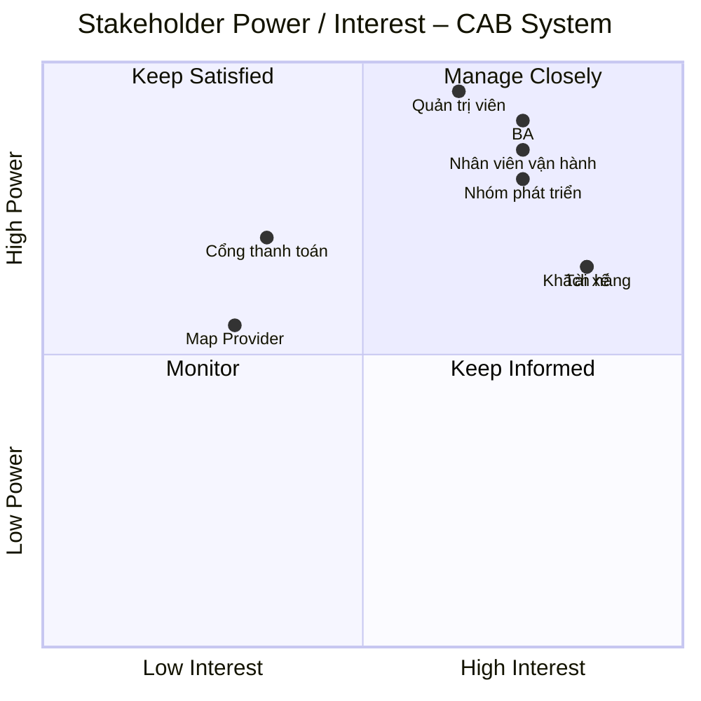
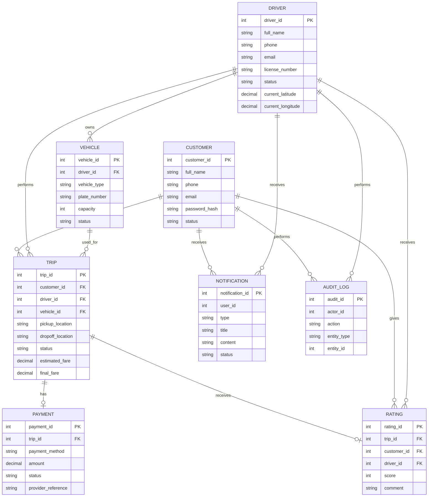
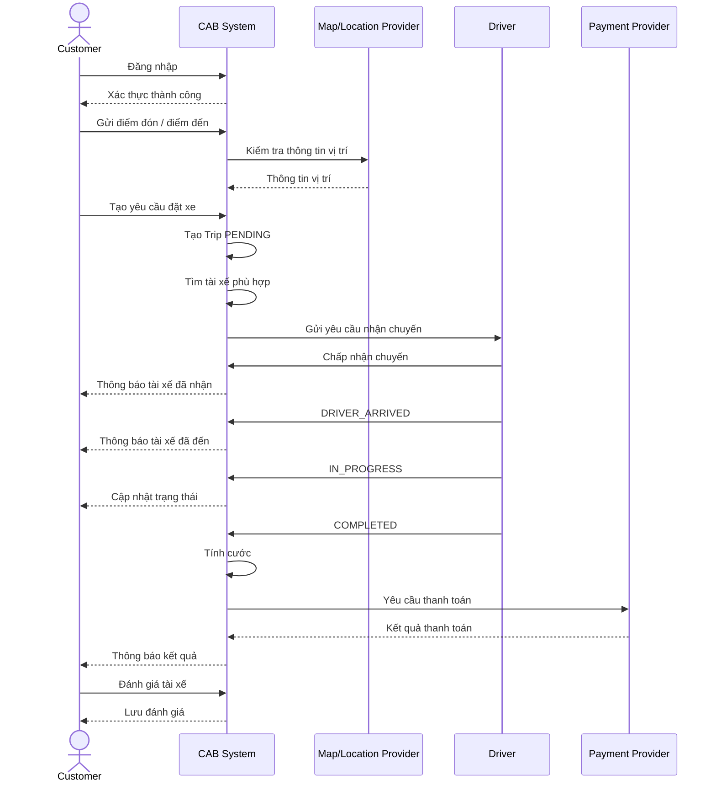

# SRS – CAB System

# Stakeholder chính

Hệ thống CAB System có các nhóm stakeholder chính sau:

- Khách hàng (Customer)
- Tài xế (Driver)
- Nhân viên vận hành (Operations)
- Quản trị viên hệ thống (Administrator)
- Đơn vị/cổng thanh toán (Payment Provider)
- Đơn vị cung cấp dịch vụ bản đồ/định vị (Map/Location Provider)
- Nhóm phát triển và bảo trì hệ thống (Development Team)
- Business Analyst (BA)

# Stakeholder – CAB System

| Stakeholder | Vai trò | Nhu cầu chính | Mức độ ảnh hưởng |
| --- | --- | --- | --- |
| Khách hàng | Người sử dụng dịch vụ đặt xe | Đăng ký, đặt xe, theo dõi chuyến, thanh toán, xem lịch sử, đánh giá | Cao |
| Tài xế | Người thực hiện chuyến xe | Nhận chuyến, cập nhật trạng thái, quản lý phương tiện, nhận thông báo | Cao |
| Nhân viên vận hành | Theo dõi và xử lý hoạt động vận hành | Quản lý khách hàng, tài xế, chuyến xe, xử lý sự cố | Cao |
| Quản trị viên | Quản trị toàn hệ thống | Quản lý tài khoản, phân quyền, cấu hình và audit | Cao |
| Cổng thanh toán | Xử lý giao dịch điện tử | Tiếp nhận yêu cầu thanh toán và trả kết quả | Trung bình |
| Map/Location Provider | Cung cấp thông tin vị trí | Định vị, khoảng cách và dữ liệu vị trí | Trung bình |
| Nhóm phát triển | Xây dựng và bảo trì hệ thống | Đảm bảo hệ thống đúng yêu cầu và dễ mở rộng | Trung bình |
| BA | Phân tích và xác nhận yêu cầu | Làm rõ nghiệp vụ, business rules và phạm vi MVP | Cao |

# Stakeholder Matrix – CAB System

## Power / Interest



# Business Rules – CAB System MVP

## 1. Quy tắc tài khoản và phân quyền

### BR-01 – Đăng ký tài khoản khách hàng

Khách hàng phải cung cấp các thông tin bắt buộc khi đăng ký tài khoản.

Thông tin không được để trống và phải đáp ứng các điều kiện hợp lệ của hệ thống.

### BR-02 – Đăng nhập

Người dùng chỉ được đăng nhập khi tài khoản tồn tại và thông tin xác thực hợp lệ.

### BR-03 – Phân quyền người dùng

Hệ thống phải phân biệt tối thiểu các vai trò:

- Customer
- Driver
- Operations
- Administrator

Mỗi vai trò chỉ được truy cập các chức năng được cấp quyền.

### BR-04 – Cập nhật thông tin cá nhân

Khách hàng và tài xế được cập nhật các thông tin cá nhân được phép thay đổi.

### BR-05 – Khóa tài khoản

Tài khoản có trạng thái không hợp lệ hoặc bị khóa không được thực hiện các chức năng yêu cầu xác thực.

## 2. Quy tắc đặt xe

### BR-06 – Tạo yêu cầu đặt xe

Khách hàng phải đăng nhập trước khi tạo yêu cầu đặt xe.

### BR-07 – Thông tin điểm đón và điểm đến

Một yêu cầu đặt xe phải có tối thiểu:

- Điểm đón
- Điểm đến
- Loại phương tiện/dịch vụ nếu có

### BR-08 – Một yêu cầu chỉ có một trạng thái hiện tại

Mỗi chuyến xe chỉ được có một trạng thái hiện tại tại một thời điểm.

### BR-09 – Không tạo chuyến trùng

Hệ thống không tạo thêm chuyến mới từ cùng một yêu cầu đặt xe đã được xử lý thành công.

### BR-10 – Hủy chuyến

Khách hàng chỉ được hủy chuyến theo trạng thái và chính sách hủy được hệ thống cho phép.

## 3. Quy tắc tìm và phân công tài xế

### BR-11 – Tài xế phải khả dụng

Chỉ tài xế đang ở trạng thái sẵn sàng mới được đưa vào danh sách phân công.

### BR-12 – Kiểm tra vị trí

Hệ thống sử dụng thông tin vị trí hiện tại của tài xế để phục vụ việc tìm tài xế phù hợp.

### BR-13 – Tiêu chí phân công

Việc tìm tài xế có thể dựa trên:

- Vị trí hiện tại
- Trạng thái tài xế
- Loại phương tiện
- Điều kiện nghiệp vụ được cấu hình

### BR-14 – Từ chối hoặc không phản hồi

Nếu tài xế từ chối hoặc không phản hồi trong khoảng thời gian được quy định, hệ thống có thể chuyển sang tài xế khác.

### BR-15 – Không tìm được tài xế

Nếu không có tài xế phù hợp, hệ thống phải thông báo cho khách hàng và ghi nhận trạng thái yêu cầu.

## 4. Quy tắc thực hiện chuyến

### BR-16 – Nhận chuyến

Tài xế chỉ được nhận chuyến được hệ thống phân công cho mình.

### BR-17 – Cập nhật trạng thái

Tài xế cập nhật trạng thái chuyến theo đúng thứ tự nghiệp vụ.

### BR-18 – Hoàn thành chuyến

Chuyến chỉ được chuyển sang trạng thái hoàn thành khi tài xế xác nhận hoàn tất chuyến.

### BR-19 – Theo dõi vị trí

Hệ thống lưu nhận dữ liệu vị trí phục vụ việc theo dõi chuyến theo phạm vi cho phép.

## 5. Quy tắc tính cước và thanh toán

### BR-20 – Tính cước

Hệ thống phải tạo thông tin cước cho chuyến xe theo công thức được xác nhận trong phạm vi nghiệp vụ.

### BR-21 – Thanh toán tiền mặt

Nếu phương thức thanh toán là tiền mặt, hệ thống ghi nhận kết quả thanh toán theo quy trình nghiệp vụ.

### BR-22 – Thanh toán điện tử

Nếu khách hàng chọn thanh toán điện tử, hệ thống gửi yêu cầu tới cổng thanh toán bên ngoài.

### BR-23 – Không lưu dữ liệu nhạy cảm

Hệ thống không lưu trực tiếp thông tin nhạy cảm của phương thức thanh toán nếu thông tin đó thuộc trách nhiệm bảo mật của cổng thanh toán.

### BR-24 – Kết quả thanh toán

Hệ thống phải ghi nhận trạng thái thanh toán dựa trên kết quả trả về từ cổng thanh toán.

## 6. Quy tắc thông báo

### BR-25 – Thông báo khách hàng

Khách hàng được thông báo các sự kiện quan trọng như:

- Đã tiếp nhận yêu cầu
- Đã phân công tài xế
- Tài xế đã đến điểm đón
- Chuyến hoàn thành
- Kết quả thanh toán

### BR-26 – Thông báo tài xế

Tài xế nhận thông báo khi có chuyến được phân công hoặc khi trạng thái chuyến thay đổi.

### BR-27 – Kênh thông báo

Kiến trúc thông báo phải có khả năng mở rộng thêm các kênh khác trong tương lai.

## 7. Quy tắc vận hành

### BR-28 – Theo dõi chuyến

Nhân viên vận hành có thể theo dõi các chuyến đang hoạt động.

### BR-29 – Quản lý dữ liệu vận hành

Nhân viên vận hành được quản lý khách hàng, tài xế, phương tiện và chuyến xe theo quyền được cấp.

### BR-30 – Audit log

Các thao tác quản trị và thao tác quan trọng phải được ghi nhận log để phục vụ kiểm tra.

### BR-31 – Báo cáo

Hệ thống hỗ trợ dữ liệu cần thiết để tạo báo cáo vận hành.

# Business Rules cần xác nhận

Các nội dung sau chưa được xác định đầy đủ trong yêu cầu khách hàng và cần BA xác nhận:

### BR-Q01 – Công thức tính cước

Chưa xác định công thức chính thức dựa trên quãng đường, thời gian, loại xe, phụ phí hay các yếu tố khác.

### BR-Q02 – Ưu tiên tài xế

Chưa xác định chính sách ưu tiên tài xế theo khoảng cách, thời gian online, đánh giá hoặc tiêu chí khác.

### BR-Q03 – Thời gian tài xế phản hồi

Chưa xác định thời gian chờ trước khi chuyển yêu cầu sang tài xế khác.

### BR-Q04 – Chính sách hủy chuyến

Chưa xác định rõ điều kiện hủy và phí hủy nếu có.

### BR-Q05 – Xử lý khi mất kết nối

Chưa xác định đầy đủ hành vi của hệ thống khi khách hàng hoặc tài xế mất kết nối.

### BR-Q06 – Lưu trữ dữ liệu

Chưa xác định thời gian lưu dữ liệu chuyến xe, giao dịch, vị trí và audit log.

### BR-Q07 – Quy tắc retry thanh toán

Chưa xác định số lần retry và khoảng thời gian giữa các lần retry.

### BR-Q08 – Quy tắc đánh giá

Chưa xác định điều kiện đánh giá, thang điểm và thời hạn đánh giá.

### BR-Q09 – Loại phương tiện

Chưa xác định đầy đủ danh sách loại xe và sức chứa.

### BR-Q10 – Phạm vi báo cáo

Chưa xác định đầy đủ các báo cáo bắt buộc cho nhân viên vận hành.

# Tổng kết Business Rules

Business Rules của CAB System MVP tập trung vào:

- Quản lý tài khoản và phân quyền
- Tạo và quản lý yêu cầu đặt xe
- Tìm và phân công tài xế
- Thực hiện và theo dõi chuyến
- Tính cước và thanh toán
- Gửi thông báo
- Quản lý vận hành và audit

Các nội dung chưa xác nhận được đánh dấu BR-Q để BA và stakeholder thống nhất trước khi triển khai chính thức.

# BUOC 4

# Business Rules – CAB System MVP

## 1. Phạm vi phát triển MVP

MVP tập trung vào luồng đặt xe cơ bản từ lúc khách hàng tạo yêu cầu cho đến khi chuyến được hoàn thành.

Luồng chính:

```text
Customer
   ↓
Đăng nhập
   ↓
Nhập điểm đón / điểm đến
   ↓
Tạo yêu cầu đặt xe
   ↓
Hệ thống tìm tài xế
   ↓
Tài xế nhận chuyến
   ↓
Tài xế đến điểm đón
   ↓
Bắt đầu chuyến
   ↓
Hoàn thành chuyến
   ↓
Tính cước
   ↓
Thanh toán
   ↓
Ghi nhận lịch sử chuyến
```

## 2. Business Rules áp dụng cho MVP

### 2.1 Quản lý khách hàng

Khách hàng có thể:

- Đăng ký
- Đăng nhập
- Cập nhật thông tin cá nhân
- Tạo yêu cầu đặt xe
- Theo dõi chuyến
- Xem lịch sử chuyến
- Xem thông tin cước
- Thực hiện thanh toán theo phương thức hỗ trợ
- Đánh giá tài xế sau chuyến

### 2.2 Quản lý tài xế

Tài xế có thể:

- Đăng ký
- Đăng nhập
- Cập nhật thông tin cá nhân
- Cập nhật thông tin phương tiện
- Chuyển trạng thái khả dụng
- Nhận hoặc từ chối chuyến
- Cập nhật trạng thái chuyến
- Cập nhật vị trí

## 3. Quy tắc tìm tài xế trong MVP

MVP thực hiện tìm tài xế dựa trên các điều kiện tối thiểu:

1. Tài xế đang hoạt động.
2. Tài xế đang ở trạng thái sẵn sàng.
3. Tài xế có phương tiện phù hợp.
4. Tài xế có vị trí hợp lệ.
5. Hệ thống lựa chọn tài xế phù hợp theo thông tin vị trí hiện tại.

Nếu tài xế được chọn từ chối hoặc không phản hồi, hệ thống tiếp tục xử lý theo cơ chế retry được cấu hình.

Nếu không tìm được tài xế, hệ thống thông báo cho khách hàng.

## 4. Luồng nghiệp vụ tối thiểu của MVP

### Bước 1

Khách hàng đăng nhập hệ thống.

### Bước 2

Khách hàng nhập điểm đón và điểm đến.

### Bước 3

Hệ thống kiểm tra dữ liệu yêu cầu.

### Bước 4

Hệ thống tạo yêu cầu đặt xe ở trạng thái `PENDING`.

### Bước 5

Hệ thống tìm tài xế phù hợp.

### Bước 6

Hệ thống gửi yêu cầu tới tài xế.

### Bước 7

Tài xế chấp nhận chuyến.

### Bước 8

Hệ thống cập nhật chuyến sang trạng thái đã phân công.

### Bước 9

Tài xế đến điểm đón và cập nhật trạng thái.

### Bước 10

Tài xế bắt đầu chuyến.

### Bước 11

Tài xế hoàn thành chuyến.

### Bước 12

Hệ thống xác định cước và trạng thái thanh toán.

### Bước 13

Hệ thống lưu lịch sử chuyến và gửi thông báo.

## 5. Các Business Rules chưa triển khai trong MVP

Các nội dung sau có thể được để ngoài phạm vi MVP hoặc chờ xác nhận:

- Chính sách giá phức tạp
- Surge pricing
- Khuyến mãi và voucher
- Chia sẻ chuyến
- Ghép chuyến
- Nhiều điểm dừng
- Ví điện tử nội bộ
- Chương trình khách hàng thân thiết
- Phân tích nâng cao
- Dự báo nhu cầu
- Thuật toán phân công nâng cao
- Hỗ trợ nhiều loại dịch vụ mở rộng

## 6. Tổng kết phạm vi MVP

MVP phải bảo đảm được một vòng đời chuyến xe hoàn chỉnh:

```text
Đăng nhập
→ Đặt xe
→ Tìm tài xế
→ Phân công
→ Nhận chuyến
→ Thực hiện chuyến
→ Hoàn thành
→ Tính cước
→ Thanh toán
→ Lưu lịch sử
```

## Kết luận

MVP của CAB System ưu tiên hoàn thiện luồng đặt xe cơ bản và các nghiệp vụ trực tiếp liên quan đến khách hàng, tài xế và vận hành.

# Business Requirements – CAB System MVP

## 1. Phạm vi MVP

Business Requirements của MVP bao gồm:

- Quản lý khách hàng
- Quản lý tài xế
- Quản lý phương tiện
- Đặt xe
- Tìm và phân công tài xế
- Quản lý trạng thái chuyến
- Theo dõi chuyến
- Tính cước
- Thanh toán
- Thông báo
- Lịch sử chuyến
- Đánh giá
- Quản lý vận hành cơ bản

## 2. Business Requirements – Quản lý khách hàng

### BR-CUS-01 – Đăng ký

Hệ thống cho phép khách hàng tạo tài khoản bằng thông tin hợp lệ.

### BR-CUS-02 – Đăng nhập

Hệ thống xác thực khách hàng trước khi sử dụng chức năng đặt xe.

### BR-CUS-03 – Quản lý hồ sơ

Khách hàng có thể xem và cập nhật hồ sơ cá nhân.

### BR-CUS-04 – Đặt xe

Khách hàng nhập điểm đón, điểm đến và gửi yêu cầu đặt xe.

### BR-CUS-05 – Theo dõi chuyến

Khách hàng xem được trạng thái hiện tại của chuyến.

### BR-CUS-06 – Lịch sử chuyến

Khách hàng xem danh sách các chuyến đã thực hiện.

### BR-CUS-07 – Đánh giá tài xế

Khách hàng có thể đánh giá tài xế sau khi chuyến hoàn thành.

## 3. Business Requirements – Quản lý tài xế

### BR-DRV-01 – Đăng ký tài xế

Hệ thống cho phép tạo hồ sơ tài xế theo thông tin được yêu cầu.

### BR-DRV-02 – Hồ sơ tài xế

Tài xế có thể xem và cập nhật thông tin được phép.

### BR-DRV-03 – Quản lý phương tiện

Tài xế có thể cập nhật thông tin phương tiện theo quyền được cấp.

### BR-DRV-04 – Trạng thái tài xế

Tài xế có thể chuyển giữa các trạng thái được hệ thống cho phép.

### BR-DRV-05 – Nhận chuyến

Tài xế có thể nhận chuyến được phân công.

### BR-DRV-06 – Từ chối chuyến

Tài xế có thể từ chối chuyến theo quy tắc hệ thống.

### BR-DRV-07 – Cập nhật chuyến

Tài xế cập nhật trạng thái chuyến trong quá trình thực hiện.

### BR-DRV-08 – Vị trí

Hệ thống tiếp nhận thông tin vị trí của tài xế để hỗ trợ phân công và theo dõi.

## 4. Business Requirements – Đặt và phân công chuyến xe

### BR-TRIP-01 – Tạo yêu cầu

Hệ thống tạo một yêu cầu đặt xe khi dữ liệu hợp lệ.

### BR-TRIP-02 – Tìm tài xế

Hệ thống tìm tài xế khả dụng phù hợp với yêu cầu.

### BR-TRIP-03 – Phân công

Hệ thống gửi yêu cầu tới tài xế được chọn.

### BR-TRIP-04 – Retry

Hệ thống có thể chuyển sang tài xế tiếp theo khi tài xế trước đó từ chối hoặc không phản hồi theo chính sách.

### BR-TRIP-05 – Không có tài xế

Hệ thống thông báo khi không tìm được tài xế phù hợp.

### BR-TRIP-06 – Theo dõi

Hệ thống cập nhật trạng thái chuyến để khách hàng và vận hành theo dõi.

## 5. Các trạng thái chuyến xe trong MVP

```text
PENDING
   ↓
DRIVER_ASSIGNED
   ↓
DRIVER_ARRIVED
   ↓
IN_PROGRESS
   ↓
COMPLETED
```

Các trạng thái ngoại lệ có thể bao gồm:

```text
CANCELLED
NO_DRIVER
PAYMENT_FAILED
```

# Functional Requirements

## FR-01 – Authentication

Hệ thống phải hỗ trợ đăng ký, đăng nhập và xác thực người dùng.

## FR-02 – Authorization

Hệ thống phải kiểm soát quyền truy cập dựa trên vai trò.

## FR-03 – Customer Management

Hệ thống phải quản lý hồ sơ khách hàng.

## FR-04 – Driver Management

Hệ thống phải quản lý hồ sơ tài xế.

## FR-05 – Vehicle Management

Hệ thống phải quản lý thông tin phương tiện.

## FR-06 – Ride Booking

Hệ thống phải cho phép khách hàng tạo yêu cầu đặt xe.

## FR-07 – Driver Matching

Hệ thống phải tìm tài xế dựa trên trạng thái, vị trí và điều kiện nghiệp vụ.

## FR-08 – Driver Assignment

Hệ thống phải gửi yêu cầu nhận chuyến tới tài xế phù hợp.

## FR-09 – Trip Management

Hệ thống phải quản lý trạng thái chuyến trong suốt vòng đời chuyến.

## FR-10 – Location Tracking

Hệ thống phải tiếp nhận và xử lý thông tin vị trí phục vụ việc theo dõi chuyến.

## FR-11 – Fare

Hệ thống phải tạo thông tin cước theo quy tắc đã xác nhận.

## FR-12 – Payment

Hệ thống phải hỗ trợ phương thức thanh toán được cấu hình.

## FR-13 – Payment Provider

Hệ thống phải có khả năng tích hợp cổng thanh toán bên ngoài.

## FR-14 – Notification

Hệ thống phải gửi thông báo cho các sự kiện quan trọng.

## FR-15 – Trip History

Hệ thống phải lưu và cho phép tra cứu lịch sử chuyến.

## FR-16 – Rating

Hệ thống phải hỗ trợ đánh giá tài xế sau chuyến.

## FR-17 – Operations

Nhân viên vận hành phải có chức năng quản lý và giám sát các dữ liệu vận hành được cấp quyền.

## FR-18 – Audit Log

Hệ thống phải ghi nhận các thao tác quan trọng để phục vụ kiểm tra.

# Non-Functional Requirements

## NFR-01 – Performance

Hệ thống phải có thời gian phản hồi phù hợp với các thao tác nghiệp vụ thông thường.

## NFR-02 – Scalability

Kiến trúc phải cho phép mở rộng độc lập các thành phần khi số lượng người dùng và chuyến xe tăng.

## NFR-03 – Availability

Hệ thống phải duy trì khả năng phục vụ ổn định trong thời gian vận hành.

## NFR-04 – Security

Hệ thống phải bảo vệ thông tin xác thực và dữ liệu người dùng.

## NFR-05 – Authorization

Các chức năng quản trị và vận hành phải được bảo vệ bằng cơ chế phân quyền.

## NFR-06 – Privacy

Thông tin cá nhân, thông tin phương tiện, vị trí và giao dịch phải được bảo vệ.

## NFR-07 – Auditability

Các thao tác quan trọng phải có log để kiểm tra.

## NFR-08 – Maintainability

Hệ thống phải có cấu trúc dễ bảo trì và mở rộng.

## NFR-09 – Extensibility

Hệ thống phải có khả năng tích hợp thêm dịch vụ thanh toán, bản đồ và thông báo.

## NFR-10 – Deployment

Các thành phần phải có khả năng triển khai và cập nhật độc lập ở mức phù hợp với kiến trúc.

# Data Requirements

## Customer

- customer_id
- full_name
- phone
- email
- password_hash
- status
- created_at
- updated_at

## Driver

- driver_id
- full_name
- phone
- email
- license_number
- status
- current_latitude
- current_longitude
- created_at
- updated_at

## Vehicle

- vehicle_id
- driver_id
- vehicle_type
- plate_number
- capacity
- status

## Trip

- trip_id
- customer_id
- driver_id
- vehicle_id
- pickup_location
- dropoff_location
- status
- estimated_fare
- final_fare
- requested_at
- completed_at

## Payment

- payment_id
- trip_id
- payment_method
- amount
- status
- provider_reference
- paid_at

## Rating

- rating_id
- trip_id
- customer_id
- driver_id
- score
- comment
- created_at

## Notification

- notification_id
- user_id
- type
- title
- content
- status
- created_at

## Audit Log

- audit_id
- actor_id
- action
- entity_type
- entity_id
- created_at

# ERD – CAB System



# Use Case – CAB System MVP

## Actor

- Customer
- Driver
- Operations
- Administrator
- Payment Provider
- Map/Location Provider

## Use Case chính

### Customer

- Đăng ký
- Đăng nhập
- Quản lý hồ sơ
- Đặt xe
- Theo dõi chuyến
- Xem lịch sử
- Thanh toán
- Đánh giá tài xế

### Driver

- Đăng ký/đăng nhập
- Quản lý hồ sơ
- Quản lý phương tiện
- Cập nhật trạng thái
- Nhận chuyến
- Từ chối chuyến
- Cập nhật trạng thái chuyến
- Cập nhật vị trí

### Operations

- Quản lý khách hàng
- Quản lý tài xế
- Quản lý phương tiện
- Theo dõi chuyến
- Theo dõi lỗi
- Tra cứu giao dịch
- Xem báo cáo

### Administrator

- Quản lý tài khoản
- Quản lý vai trò
- Quản lý quyền
- Xem audit log
- Quản lý cấu hình

# Sequence – Đặt xe



# Traceability Matrix

| Business Requirement | Functional Requirement | Business Rule |
| --- | --- | --- |
| BR-CUS-01 | FR-01 | BR-01 |
| BR-CUS-02 | FR-01 | BR-02 |
| BR-CUS-03 | FR-03 | BR-04 |
| BR-CUS-04 | FR-06 | BR-06, BR-07 |
| BR-CUS-05 | FR-09, FR-10 | BR-17, BR-19 |
| BR-CUS-06 | FR-15 | BR-28 |
| BR-CUS-07 | FR-16 | BR-Q08 |
| BR-DRV-01 | FR-04 | BR-01 |
| BR-DRV-03 | FR-05 | BR-13 |
| BR-DRV-05 | FR-08 | BR-16 |
| BR-DRV-07 | FR-09 | BR-17, BR-18 |
| BR-TRIP-01 | FR-06 | BR-06, BR-07, BR-09 |
| BR-TRIP-02 | FR-07 | BR-11, BR-12, BR-13 |
| BR-TRIP-03 | FR-08 | BR-14 |
| BR-TRIP-04 | FR-07, FR-08 | BR-14 |
| BR-TRIP-05 | FR-07 | BR-15 |
| BR-TRIP-06 | FR-09 | BR-17 |

# Exception / Error Handling

## EX-01 – Dữ liệu đặt xe không hợp lệ

Hệ thống từ chối yêu cầu và hiển thị thông tin lỗi.

## EX-02 – Không có tài xế

Hệ thống thông báo không có tài xế phù hợp.

## EX-03 – Tài xế từ chối

Hệ thống thực hiện tìm tài xế tiếp theo theo chính sách.

## EX-04 – Tài xế không phản hồi

Hệ thống xử lý timeout và có thể retry.

## EX-05 – Thanh toán thất bại

Hệ thống ghi nhận trạng thái thất bại và xử lý retry theo chính sách đã xác nhận.

## EX-06 – Mất kết nối

Hệ thống phải duy trì dữ liệu trạng thái gần nhất và đồng bộ lại khi kết nối được khôi phục theo khả năng của hệ thống.

# Open Issues

Các vấn đề cần BA/stakeholder xác nhận:

1. Công thức tính cước chính thức.
2. Tiêu chí ưu tiên tài xế.
3. Timeout khi tài xế không phản hồi.
4. Chính sách hủy chuyến.
5. Chính sách retry thanh toán.
6. Thời gian lưu dữ liệu.
7. Quy tắc đánh giá.
8. Danh sách loại phương tiện.
9. Kênh thông báo chính thức.
10. Phạm vi báo cáo vận hành.

# Kết luận

CAB System MVP tập trung vào việc số hóa và chuẩn hóa quy trình đặt xe từ lúc khách hàng gửi yêu cầu, hệ thống tìm và phân công tài xế, tài xế thực hiện chuyến, đến khi hoàn thành, tính cước, thanh toán và lưu lịch sử.

Các Business Rules chưa được xác nhận được tách riêng để BA và stakeholder tiếp tục làm rõ trước khi chốt thiết kế chi tiết.

Cấu trúc tài liệu được thiết kế để có thể tiếp tục mở rộng sang thiết kế API, cơ sở dữ liệu MySQL, Swagger/OpenAPI và triển khai hệ thống Node.js + Express.js trong các bước tiếp theo.
